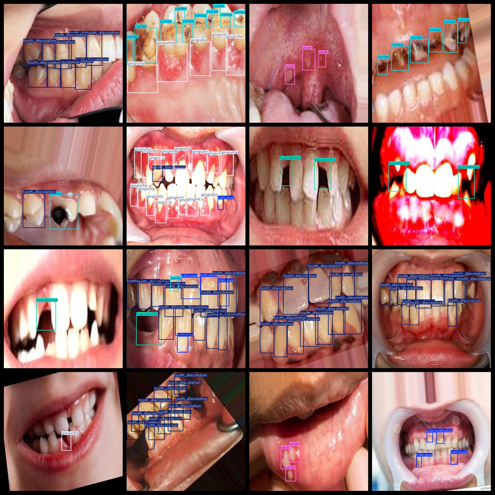
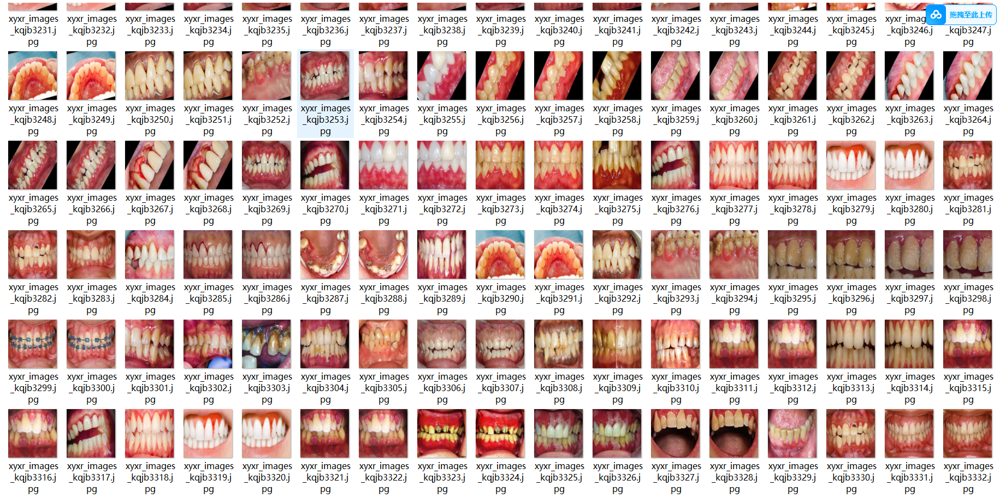
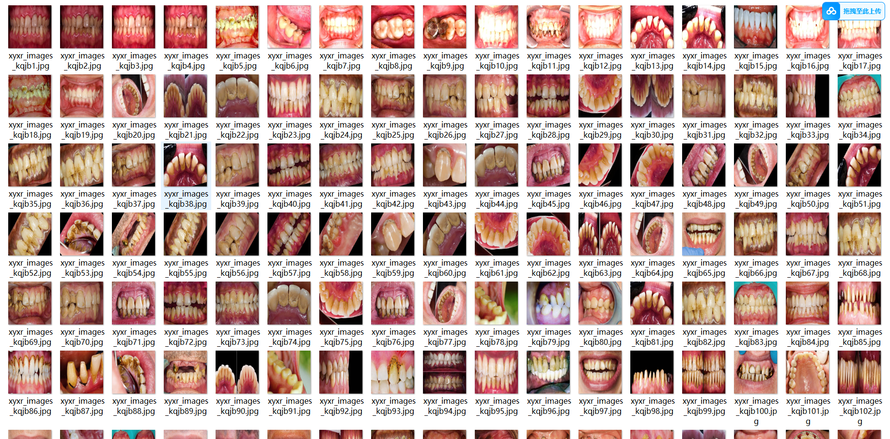

# [Object Detection] Mouth Disease Dataset 10,000 Images in YOLO+VOC Format

[Target Detection] The oral disease dataset consists of 10,000 images in both YOLO and VOC formats.

The dataset is organized into three folders: JPEGImages, Annotations, and labels. Within the JPEGImages folder, there are a total of 10,000 JPEG images. The Annotations folder contains a total of 10,000 XML files. Additionally, there are 10,000 txt files in the labels folder.

The number of jpg images in the JPEGImages folder is 10,000. The xml files in the Annotations folder amount to 10,000, while the txt files within the labels folder total up to 10,000.

There are a total of 6 label categories: ["calculus", "caries", "gingivitis", "hypodontia", "tooth_discolation", "ulcer"].

The number of boxes (yolo format) for each label category varies:
- "calculus" has 9,171 boxes
- "caries" has 11,867 boxes
- "gingivitis" has 10,254 boxes
- "hypodontia" has 2,382 boxes
- "tooth_discolation" has 26,636 boxes
- "ulcer" has 3,558 boxes

Total box count: 63,868

The image resolutions are all clear with high quality.

Images have been enhanced.

The shape of the labels used for target detection is a rectangle box.

Important Notice: No guarantee is made regarding the accuracy or precision of the models trained on this dataset or any weight files. This dataset only provides accurate and reasonable annotations.

Special Disclaimer: This dataset does not guarantee any level of accuracy or precision for models trained on it or any weight files. The dataset provides accurate and reasonable annotations only.

## Images

---

Here is a pay link on Stripe (https://buy.stripe.com/3cs8yP7sY87d0vu9AB). Please contact me lonlonago@foxmail.com after funding $89, and I will send you a complete data files, thank you!

